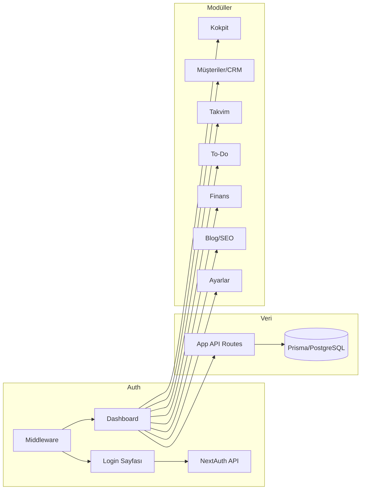

# Sosyalcan Komuta Merkezi — Proje A'dan Z'ye Anlatım

## 1. Proje Nedir?

**Sosyalcan Komuta Merkezi** (`sosyalcan-komuta-merkezi` v0.1.0), **Sosyalcan** markası için tek bir panelde toplanmış bir **ERP/CRM operasyon paneli**dir. Amaç: kokpit, müşteri/lead yönetimi, takvim, to-do, finans, blog/SEO ve ayarları tek uygulama içinde yönetmek. **Kayıt yok**; sadece veritabanında tanımlı **SUPER_ADMIN** kullanıcılar giriş yapabilir (Appwrite kullanıcıları ile giriş yapılır).

---

## 2. Teknoloji Yığını

| Katman | Teknoloji |
|--------|-----------|
| Framework | Next.js 14.2.5 (App Router), React 18 |
| Veritabanı | PostgreSQL + Prisma ORM |
| Auth | NextAuth.js (Credentials, JWT, session) |
| Stil | Tailwind CSS, karanlık tema (`class="dark"`) |
| UI | Radix UI, Framer Motion, Lucide, Sonner (toast) |
| Form / Validasyon | React Hook Form, Zod, @hookform/resolvers |
| Rich text | Tiptap (Blog) |
| Sürükle-bırak | @dnd-kit (To-Do Kanban) |
| Grafik | Recharts (Finans donut) |
| PDF | jspdf (proforma fatura) |
| State | Zustand (gerekli yerlerde) |
| Diğer | date-fns, bcryptjs, class-variance-authority, clsx, tailwind-merge |

Kurulum için: `npm install`, `.env` (DATABASE_URL, NEXTAUTH_SECRET, NEXTAUTH_URL), `npx prisma db push`, `npm run db:seed`, `npm run dev`.

---

## 3. Dizin Yapısı ve Giriş Noktaları

```
SOSYALCAN/
├── prisma/
│   ├── schema.prisma   # Tüm modeller ve enum'lar
│   └── seed.ts         # (Appwrite kullanıcıları Console'dan oluşturulur)
├── src/
│   ├── app/            # Next.js App Router
│   │   ├── layout.tsx        # Kök layout (Inter, dark, AuthSessionProvider, Toaster)
│   │   ├── page.tsx          # Ana sayfa → /dashboard yönlendirmesi
│   │   ├── globals.css
│   │   ├── login/page.tsx
│   │   ├── dashboard/
│   │   │   ├── layout.tsx    # Sidebar + header + NotificationSSE
│   │   │   ├── page.tsx      # Kokpit
│   │   │   ├── customers/    # Müşteriler & CRM
│   │   │   ├── temas/        # Temas (randevu/iletişim odaklı görünüm)
│   │   │   ├── calendar/     # Takvim
│   │   │   ├── todo/         # To-Do Kanban
│   │   │   ├── finance/      # Finans
│   │   │   ├── blog/         # Blog & SEO CMS
│   │   │   └── settings/     # Ayarlar (audit, bildirim tercihleri)
│   │   └── api/
│   │       ├── auth/[...nextauth]/route.ts   # NextAuth handler
│   │       ├── leads/, customers/, appointments/, tasks/
│   │       ├── transactions/, subscriptions/, balances/
│   │       ├── posts/, upload/, notifications/, audit/
│   │       └── sse/notifications/route.ts     # SSE bildirim akışı
│   ├── components/    # UI bileşenleri (dashboard, crm, calendar, todo, finance, blog, providers, ui)
│   ├── lib/           # auth, prisma, finance, audit, validations, db-error, utils
│   ├── types/         # next-auth.d.ts vb.
│   └── middleware.ts  # Auth koruması ve yönlendirmeler
├── .env, .env.example
├── next.config.js, tailwind.config.ts, postcss.config.js, tsconfig.json
└── package.json
```

- **Giriş:** Tarayıcı `/` → middleware ile `/dashboard`e yönlendirilir; giriş yoksa `/login`.
- **Auth API:** Tüm dashboard ve API koruması NextAuth session + middleware ile yapılır.

---

## 4. Güvenlik ve Kimlik Doğrulama

- **Kayıt sayfası yok.** Sadece veritabanında `role = SUPER_ADMIN` olan kullanıcılar giriş yapabilir.
- **src/lib/auth.ts:** Credentials provider; email + şifre, bcrypt karşılaştırma, role kontrolü. JWT session (30 gün), callback'lerde `token.id` / `session.user.id` set edilir.
- **src/middleware.ts:**
  - `/api/auth/*` her zaman serbest.
  - Development + localhost ise bypass (DX): `/` → `/dashboard`, diğer route'lar açık.
  - Production'da: `/dashboard` ve altı korumalı; token yoksa `/login?callbackUrl=...`. Giriş yapmış kullanıcı `/login`'e giderse `/dashboard`'e yönlendirilir.

---

## 5. Veritabanı Modeli (Prisma) — Özet

- **User:** id, name, email, password (hash), role (SUPER_ADMIN), image; ilişkiler: Task, Appointment, Transaction, Post, Media, AuditLog, Notification, Balance.
- **Lead:** name, email, phone, sector, budget, source (vitrin | manual | referans | instagram | google | web_site), temperature (COLD | WARM | HOT), convertedAt. Lead → Customer 1:1 (convert ile).
- **Customer:** leadId (unique), name, email, phone, company, notes, deletedAt (soft delete). İlişkiler: Lead, Subscription[], Transaction[].
- **Subscription:** customerId, planName, packageType (STARTER/PRO/PREMIUM), amount, startDate, nextPaymentDate, status (active | paused | cancelled | past_due), remainingAmount, remainingDueDate. Transaction ile ilişkili (tahsilat/kısmi ödeme).
- **Appointment:** title, description, start, end, type (crm | todo | finance), relatedId, relatedType, userId.
- **Task:** title, description, status (BEKLEYEN | KURGUDA | REVIZEDE | TAMAMLANDI), assigneeId, urgency (high | medium | low), dueDate, order (Kanban sırası).
- **Transaction:** type (income | expense), amount, description, date, category, customerId, status (PENDING | COMPLETED | OVERDUE), subscriptionId, isPartialPayment, expenseTag (GENERAL | PROJECT), createdBy. TransactionSplit ile 1:N (dağılım).
- **TransactionSplit:** transactionId, bucket (EREN | KERIM | GIDER | BIRIKIM | ACIL_DURUM), percentage, amount. Sabit oran: 30/30/15/15/10.
- **Balance:** userId (null = GIDER/BIRIKIM/ACIL_DURUM), bucket, balance. Gelir girildikçe güncellenir.
- **Post:** title, slug, content (rich text), coverImageUrl, metaTitle, metaDescription (≈160 karakter), publishedAt, authorId.
- **Media:** url, key, filename, mimeType, size, entityType, entityId, uploadedById.
- **AuditLog:** userId, action, entityType, entityId, payload (JSON).
- **Notification:** userId (null = broadcast), type, title, message, readAt, entityType, entityId.

---

## 6. Özellik Modülleri (Kısa Özet)

- **Kokpit (src/app/dashboard/page.tsx):** Aylık net ciro (gelir−gider), yeni potansiyel sayısı, bugünün randevu sayısı, aktif abonelik sayısı; ContactAlertsWidget; vitrin etkileşimleri tablosu (LeadStreamTable).
- **Müşteriler & CRM:** Lead listesi, slide-over detay, "Müşteriye Çevir" (API: src/app/api/leads/[id]/convert/route.ts — Customer oluşturur, lead.convertedAt set eder, audit log). Aktif müşteriler: Starter/Pro/Premium paket atama, direct customer ekleme.
- **Takvim:** Tek takvim; CRM, To-Do, Finans randevuları; slide-over ile ekleme/düzenleme; API: appointments CRUD.
- **To-Do:** Kanban (Bekleyen → Kurguda → Revizede → Tamamlandı), @dnd-kit ile sürükle-bırak, atanan kullanıcı ve aciliyet; API: tasks CRUD + PATCH status/order.
- **Finans:** Gelir/Gider işlemleri; net ciro sabit dağılım (30/30/15/15/10) — src/lib/finance.ts kuruş-safe `splitAmountKurusSafe`. Donut chart, bakiye kartları, abonelik vade/ödeme uyarıları; proforma fatura (jspdf); kısmi tahsilat ve subscription ilişkisi.
- **Blog & SEO CMS:** Rich text (Tiptap), kapak, meta başlık/açıklama (160 karakter); API: posts CRUD, upload.
- **Ayarlar:** Audit log görüntüleme, bildirim tercihleri.

---

## 7. API Route'lar ve Ortak Desenler

- **Auth:** Tüm korumalı API'ler `getServerSession(authOptions)` ile session alır; `session?.user?.id` yoksa 401.
- **Audit:** Önemli aksiyonlarda src/lib/audit.ts `auditLog({ userId, action, entityType, entityId, payload })` çağrılır (örn. lead.converted).
- **Hata:** src/lib/db-error.ts ile Prisma bağlantı hatalarında 503 ve anlamlı mesaj.
- **Finans:** Gelir eklendiğinde `splitAmountKurusSafe` ile split'ler ve Balance güncellemeleri transaction içinde yapılır; Kullanıcı 1/2 bakiye ataması projedeki ilk iki kullanıcı ile yapılır (src/app/api/transactions/route.ts).

Önemli API örnekleri:
- `POST /api/leads/[id]/convert` — Lead → Customer dönüşümü.
- `GET/POST /api/transactions` — Filtre (from/to), listeleme; POST'ta gelir için dağılım + balance güncellemesi.
- `GET /api/sse/notifications` — SSE ile son 30 saniyedeki bildirimler (5 sn poll); bağlantı kopunca interval temizlenir.

---

## 8. Ön Yüz ve UX

- **Layout:** Dashboard layout'ta sabit sol sidebar (Sosyalcan logo, SidebarNav, kullanıcı bilgisi, SignOutButton), sağda main + header. Bildirimler için NotificationSSE SSE'e abone olur.
- **Tema:** Karanlık tema (Tailwind `dark` class), cam efektli (backdrop-blur) kart/sidebar; slide-over formlar (Radix tabanlı SlideOver) ile ekleme/düzenleme.
- **Formlar:** React Hook Form + Zod (örn. src/lib/validations/lead.ts, customer, finance); Sonner ile toast geri bildirimi.

---

## 9. Akış Diyagramı (Özet)



---

## 10. Özet Tablo

| Konu | Açıklama |
|------|----------|
| **Amaç** | Tek panelde ERP/CRM: kokpit, lead/müşteri, takvim, to-do, finans, blog, ayarlar |
| **Kullanıcılar** | Appwrite kullanıcıları; kayıt sayfası yok |
| **Veritabanı** | PostgreSQL + Prisma; Lead→Customer, Subscription, Transaction+Split+Balance, Task, Appointment, Post, AuditLog, Notification |
| **Finans** | Gelir/gider; gelirde sabit %30/30/15/15/10 dağılım; kuruş-safe hesaplama |
| **Güvenlik** | NextAuth JWT + middleware; production'da /dashboard korumalı |
| **Bildirim** | SSE ile 5 sn'de bir poll; son 30 sn, kullanıcıya veya broadcast |

Bu doküman projeyi A'dan Z'ye tek referans noktası olarak kullanılabilir; implementasyon detayları için ilgili `src/app`, `src/components` ve `src/lib` dosyalarına bakılmalıdır.
