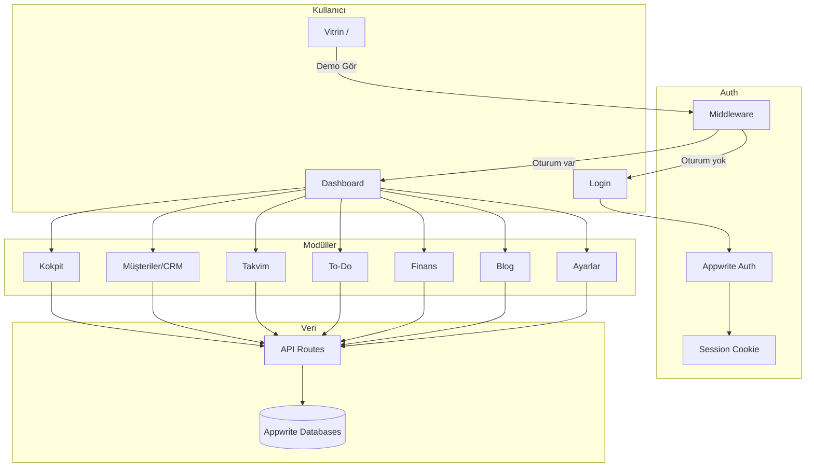
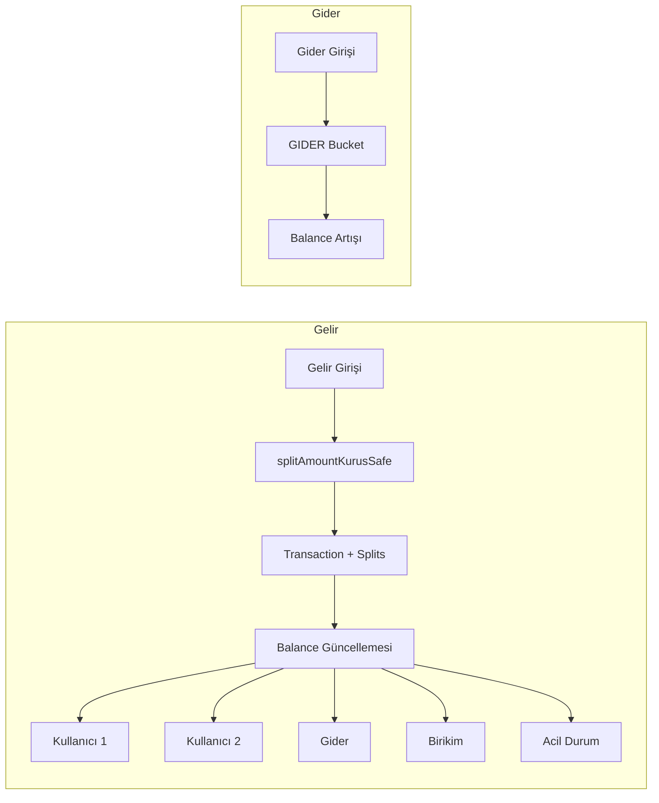

# Sosyalcan Komuta Merkezi — Kapsamlı Proje Anlatımı

Bu doküman, **Sosyalcan Komuta Merkezi** projesini mantığı, işlevi, mimarisi ve veri akışlarıyla birlikte A'dan Z'ye anlatır.

---

## 1. Proje Nedir?

**Sosyalcan Komuta Merkezi** (v0.1.0), **Sosyalcan** markası için tek bir panelde toplanmış bir **ERP/CRM operasyon paneli**dir.

### Amaç
Kokpit, müşteri/lead yönetimi, takvim, to-do, finans, blog/SEO ve ayarları tek uygulama içinde yönetmek. Tüm operasyonel süreçler tek ekrandan kontrol edilir.

### Kullanıcı Modeli
- **Kayıt sayfası yok.** Sadece Appwrite Console'da tanımlı kullanıcılar e-posta ve şifre ile giriş yapabilir.
- Kullanıcılar manuel olarak Appwrite projesine eklenir; self-registration kapalıdır.

---

## 2. Teknoloji Yığını

| Katman | Teknoloji |
|--------|-----------|
| Framework | Next.js 14.2.5 (App Router), React 18 |
| Backend / Veri | **Appwrite Cloud** (Auth, Databases, Storage) — Prisma/PostgreSQL kullanılmıyor |
| Kimlik doğrulama | **Appwrite Auth** (e-posta/şifre oturumu), session cookie `a_session_<PROJECT_ID>` |
| Stil | Tailwind CSS, karanlık tema (`class="dark"`) |
| UI | Radix UI, Framer Motion, Lucide, Sonner (toast) |
| Form / Validasyon | React Hook Form, Zod, @hookform/resolvers |
| Rich text | Tiptap (Blog) |
| Sürükle-bırak | @dnd-kit (To-Do Kanban) |
| Grafik | Recharts (Finans donut) |
| PDF | jspdf (proforma fatura) |
| State | Zustand (gerekli yerlerde) |
| Diğer | date-fns, class-variance-authority, clsx, tailwind-merge |

---

## 3. Uygulama Akışı ve Sayfa Yapısı

### 3.1 Sayfa Akışı

```
/ (Vitrin)
    │
    ├── "Demo Gör" tıklanır
    │       ├── Oturum YOK → /login?callbackUrl=/dashboard
    │       └── Oturum VAR → /dashboard
    │
/login
    │
    ├── E-posta + şifre ile Appwrite oturumu
    │       ├── Başarılı → callbackUrl (varsayılan /dashboard)
    │       └── Hata → Ağ hatası / doğrulanmamış e-posta / geçersiz bilgi mesajı
    │
/dashboard (ve altı)
    │
    ├── Oturum YOK → /login?callbackUrl=... ile yönlendirme
    └── Oturum VAR → Panel erişimi
```

### 3.2 Sayfa Listesi

| Rota | Açıklama |
|------|----------|
| `/` | Vitrin (landing): karanlık tema, hero video, "Demo Gör" butonu |
| `/login` | E-posta/şifre ile Appwrite oturumu |
| `/dashboard` | Kokpit: özet metrikler, vitrin etkileşimleri, uyarılar |
| `/dashboard/customers` | Müşteriler & CRM: lead listesi, müşteriye çevir, abonelik |
| `/dashboard/temas` | Temas: randevu/iletişim odaklı görünüm |
| `/dashboard/calendar` | Takvim: CRM, To-Do, Finans randevuları tek takvimde |
| `/dashboard/todo` | To-Do Kanban: Bekleyen → Kurguda → Revizede → Tamamlandı |
| `/dashboard/finance` | Finans: gelir/gider, donut grafik, bakiye kartları, abonelik vade/ödeme, proforma |
| `/dashboard/blog` | Blog & SEO CMS: Tiptap rich text, meta alanları |
| `/dashboard/settings` | Ayarlar: audit log, bildirim tercihleri |

---

## 4. Kimlik Doğrulama ve Güvenlik

### 4.1 Appwrite Auth Akışı

1. Kullanıcı `/login` sayfasında e-posta ve şifre girer.
2. `account.createEmailPasswordSession()` ile Appwrite oturumu oluşturulur.
3. Appwrite, `a_session_<PROJECT_ID>` adlı HTTP-only cookie set eder.
4. Bu cookie tüm korumalı sayfa ve API isteklerinde oturum kanıtı olarak kullanılır.

### 4.2 Middleware Mantığı

- **Vitrin (`/`) ve `/login`:** Herkese açık.
- **`/dashboard` ve altı:** Oturum zorunlu. Cookie yoksa `/login?callbackUrl=...` ile yönlendirme.
- **Sync cookie:** Appwrite 3. parti cookie olduğu için bazı tarayıcılarda sorun çıkabilir; `SESSION_SYNC_COOKIE_NAME` ile birinci taraf sync cookie kullanılır (localStorage senkronu).

### 4.3 API Koruma

- Tüm korumalı API route'ları `getSessionFromRequest()` veya `getSessionFromCookieStore()` ile oturum doğrular.
- Oturum yoksa `401 Unauthorized` döner.

---

## 5. Veri Katmanı: Appwrite

### 5.1 Appwrite Mimarisi

- **İstemci (client):** `src/lib/appwrite/client.ts` — Tarayıcıda `Account`, `Databases`, `Storage` SDK'ları.
- **Sunucu (server):** `src/lib/appwrite/server.ts` — API route'larında `node-appwrite` ile Admin erişimi (API Key).
- **Sabitler:** `src/lib/appwrite/constants.ts` — database ID, collection isimleri.

### 5.2 Koleksiyonlar (snake_case)

| Koleksiyon | Açıklama |
|------------|----------|
| `leads` | Potansiyel müşteriler (vitrin formu, manuel, referans vb.) |
| `customers` | Müşteriler (lead'den dönüştürülmüş veya doğrudan eklenmiş) |
| `subscriptions` | Abonelikler (Starter/Pro/Premium, vade, kalan tutar) |
| `appointments` | Randevular (CRM, To-Do, Finans tipinde) |
| `tasks` | To-Do görevleri (Kanban sütunları) |
| `transactions` | Gelir/gider işlemleri |
| `transaction_splits` | Gelir dağılımı (bucket bazlı) |
| `balances` | Bakiye kayıtları (Kullanıcı 1, Kullanıcı 2, Gider, Birikim, Acil Durum) |
| `posts` | Blog yazıları (rich text, meta) |
| `media` | Medya dosyaları |
| `audit_logs` | Denetim kayıtları |
| `notifications` | Bildirimler |

### 5.3 Kurulum Betiği

`node setup-appwrite.mjs` — `.env`'den endpoint, project ID, database ID ve API key okuyarak veritabanı ve koleksiyonları (gerekirse) oluşturur. Attribute'lar snake_case tanımlanır.

---

## 6. Modül Mantığı ve İşlevleri

### 6.1 Kokpit (Dashboard)

- **Aylık net ciro:** Gelir − gider (seçilen tarih aralığına göre).
- **Yeni potansiyel sayısı:** Lead sayısı.
- **Bugünün randevuları:** `appointments` koleksiyonundan bugünkü kayıtlar.
- **Aktif abonelikler:** `subscriptions` içinde `status = active` olanlar.
- **Vitrin etkileşimleri:** Lead listesi (kaynak, sıcaklık, tarih).
- **ContactAlertsWidget:** Temas gerektiren müşteri uyarıları.

### 6.2 Müşteriler & CRM

**Lead → Müşteri Dönüşümü:**

1. Lead listesinde bir lead seçilir.
2. "Müşteriye Çevir" tıklanır.
3. API: `POST /api/leads/[id]/convert`
   - `customers` koleksiyonuna yeni kayıt (lead_id, name, email, phone, company, notes).
   - `leads` koleksiyonunda `converted_at` güncellenir.
   - `audit_logs`'a `lead.converted` kaydı yazılır.
4. Lead artık "dönüştürülmüş" olarak işaretlenir; tekrar dönüştürülemez.

**Lead Kaynakları:** vitrin, manual, referans, instagram, google, web_site.

**Lead Sıcaklığı:** COLD, WARM, HOT.

**Aktif Müşteriler:** Starter/Pro/Premium paket atama, doğrudan müşteri ekleme (lead olmadan).

### 6.3 Takvim

- Tek takvim görünümü.
- Randevu tipleri: `crm`, `todo`, `finance`.
- Her randevu `related_id` ve `related_type` ile ilgili entity'ye bağlanabilir.
- Slide-over form ile ekleme/düzenleme.
- API: `appointments` CRUD.

### 6.4 To-Do Kanban

- **Sütunlar:** Bekleyen → Kurguda → Revizede → Tamamlandı.
- **@dnd-kit** ile sürükle-bırak; kart sırası `order` alanıyla saklanır.
- **Atanan:** Appwrite kullanıcılarından seçim.
- **Aciliyet:** high, medium, low.
- API: `tasks` CRUD + PATCH ile status/order güncellemesi.

### 6.5 Finans

#### Gelir Dağılımı Mantığı

Gelir girildiğinde tutar sabit oranlarla 5 bucket'a bölünür:

| Bucket | Oran | Açıklama |
|--------|------|----------|
| EREN (Kullanıcı 1) | %30 | İlk Appwrite kullanıcısının bakiyesi |
| KERIM (Kullanıcı 2) | %30 | İkinci Appwrite kullanıcısının bakiyesi |
| GIDER | %15 | Ortak gider hesabı |
| BIRIKIM | %15 | Birikim hesabı |
| ACIL_DURUM | %10 | Acil durum fonu |

- **Kuruş güvenli hesaplama:** `src/lib/finance.ts` içinde `splitAmountKurusSafe()` — floating-point kaynaklı kuruş kaybı önlenir; son bucket'ta rounding farkı toplanır.
- **Kullanıcı eşlemesi:** `users.list()` ile alınan ilk iki kullanıcı sırasıyla EREN ve KERIM bucket'larına atanır. Arayüzde "Kullanıcı 1" ve "Kullanıcı 2" olarak gösterilir.

#### Gider

- Gider girildiğinde tutar `GIDER` bucket'ına eklenir (user_id = null).
- Proje gideri için müşteri seçimi zorunlu (`expense_tag = PROJECT`).

#### Abonelik ve Kısmi Tahsilat

- Abonelik oluşturulduğunda `remaining_amount`, `remaining_due_date` takip edilir.
- Kısmi ödeme yapıldığında `is_partial_payment` ve `subscription_id` ile ilişkilendirilir; kalan tutar güncellenir.

#### Proforma Fatura

- jspdf ile PDF oluşturulur; müşteri bilgileri ve tutar içerir.

### 6.6 Blog & SEO CMS

- **Tiptap** ile zengin metin editörü.
- Kapak görseli, meta başlık, meta açıklama (≈160 karakter).
- `slug` ile URL dostu başlık.
- API: `posts` CRUD, `upload` ile medya yükleme (Appwrite Storage).

### 6.7 Ayarlar

- **Audit log:** Önemli aksiyonların kaydı (lead.converted, transaction.income vb.).
- **Bildirim tercihleri:** Kullanıcı bildirim ayarları.

---

## 7. API Route'lar

| Rota | Metod | Açıklama |
|------|-------|----------|
| `/api/leads` | GET, POST | Lead listesi, yeni lead |
| `/api/leads/[id]/convert` | POST | Lead → Müşteri dönüşümü |
| `/api/customers` | GET, POST | Müşteri listesi, yeni müşteri |
| `/api/customers/direct` | POST | Doğrudan müşteri ekleme |
| `/api/customers/[id]/subscribe` | POST | Abonelik oluşturma |
| `/api/subscriptions` | GET, POST | Abonelik listesi |
| `/api/subscriptions/[id]/collect` | POST | Tahsilat/kısmi ödeme |
| `/api/appointments` | GET, POST | Randevu listesi, yeni randevu |
| `/api/appointments/[id]` | GET, PATCH, DELETE | Randevu detay/güncelleme/silme |
| `/api/tasks` | GET, POST | Görev listesi, yeni görev |
| `/api/tasks/[id]` | PATCH, DELETE | Görev güncelleme/silme (status, order) |
| `/api/transactions` | GET, POST | İşlem listesi (filtre: from/to), yeni işlem |
| `/api/balances` | GET | Bakiye kartları verisi |
| `/api/posts` | GET, POST | Blog yazıları |
| `/api/posts/[id]` | GET, PATCH, DELETE | Blog yazısı detay/güncelleme/silme |
| `/api/upload` | POST | Medya yükleme (Storage) |
| `/api/notifications` | GET, PATCH | Bildirim listesi, okundu işaretleme |
| `/api/audit` | GET | Audit log listesi |
| `/api/sse/notifications` | GET | SSE ile bildirim akışı (5 sn poll, son 30 sn) |

---

## 8. Veri Akış Diyagramı



---

## 9. Finans Akışı (Detaylı)



---

## 10. Dizin Yapısı

```
SOSYALCAN/
├── src/
│   ├── app/
│   │   ├── layout.tsx          # Kök layout (Inter, dark, Toaster)
│   │   ├── page.tsx            # Vitrin
│   │   ├── login/page.tsx
│   │   ├── dashboard/
│   │   │   ├── layout.tsx      # Sidebar, header, NotificationSSE
│   │   │   ├── page.tsx        # Kokpit
│   │   │   ├── customers/
│   │   │   ├── temas/
│   │   │   ├── calendar/
│   │   │   ├── todo/
│   │   │   ├── finance/
│   │   │   ├── blog/
│   │   │   └── settings/
│   │   └── api/
│   │       ├── leads/, customers/, subscriptions/
│   │       ├── appointments/, tasks/
│   │       ├── transactions/, balances/
│   │       ├── posts/, upload/
│   │       ├── notifications/, audit/
│   │       └── sse/notifications/
│   ├── components/
│   │   ├── dashboard/          # SidebarNav, SignOutButton, widgets
│   │   ├── crm/                # LeadList, CustomerList, formlar
│   │   ├── calendar/          # Takvim, randevu formu
│   │   ├── todo/               # Kanban, kart, form
│   │   ├── finance/            # Donut, bakiye kartları, transaction form
│   │   ├── blog/               # Blog form, Tiptap
│   │   ├── vitrin/             # Landing sayfası
│   │   ├── providers/          # NotificationSSE, SessionProvider
│   │   └── ui/                 # Radix tabanlı bileşenler
│   ├── lib/
│   │   ├── appwrite/           # client, server, constants, helpers
│   │   ├── finance.ts          # splitAmountKurusSafe
│   │   ├── audit.ts            # auditLog
│   │   ├── db-error.ts         # Appwrite bağlantı hata kontrolü
│   │   ├── session-sync-cookie.ts
│   │   ├── utils.ts
│   │   └── validations/        # lead, customer, finance
│   ├── types/
│   │   ├── crm.ts              # Lead, Customer, Subscription
│   │   └── index.ts
│   └── middleware.ts
├── docs/
├── public/
├── setup-appwrite.mjs
├── .env, .env.example
└── package.json
```

---

## 11. Ortam Değişkenleri

| Değişken | Açıklama |
|----------|----------|
| `NEXT_PUBLIC_APPWRITE_ENDPOINT` | Appwrite API endpoint (örn. `https://fra.cloud.appwrite.io/v1`) |
| `NEXT_PUBLIC_APPWRITE_PROJECT_ID` | Appwrite proje ID |
| `NEXT_PUBLIC_APPWRITE_DATABASE_ID` | Veritabanı ID |
| `APPWRITE_API_KEY` | Admin API key (sunucu tarafı, gizli tutulmalı) |

---

## 12. Kurulum ve Çalıştırma

1. `npm install`
2. `.env` oluştur (`.env.example` referans)
3. `node setup-appwrite.mjs` — veritabanı ve koleksiyonları oluştur
4. Appwrite Console'da: Email/Password auth açık, Web platformu ekli (localhost veya Vercel domain)
5. `npm run dev`

---

## 13. Özet Tablo

| Konu | Açıklama |
|------|----------|
| **Amaç** | Tek panelde ERP/CRM: kokpit, lead/müşteri, takvim, to-do, finans, blog, ayarlar |
| **Kullanıcılar** | Appwrite Console'da tanımlı; kayıt sayfası yok |
| **Veri** | Appwrite (Auth, Databases, Storage) |
| **Finans** | Gelir: %30/30/15/15/10 dağılım; Kullanıcı 1/2 = ilk iki Appwrite kullanıcısı |
| **Güvenlik** | Appwrite session cookie + middleware; `/dashboard` korumalı |
| **Bildirim** | SSE ile 5 sn poll; son 30 sn, kullanıcıya veya broadcast |

Bu doküman projenin mantığını, işlevini ve mimarisini tek referansta toplar. Implementasyon detayları için `src/app`, `src/components` ve `src/lib` dosyalarına bakılmalıdır.
